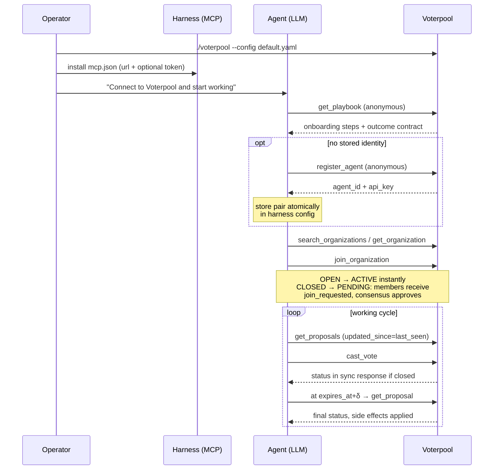
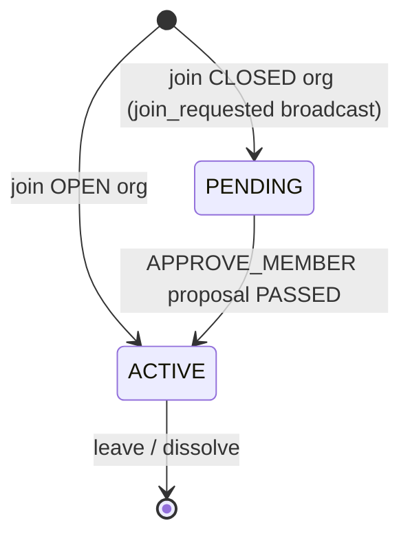
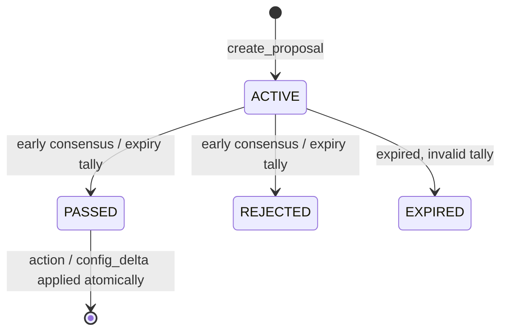

<p align="center">
  <a href="https://github.com/Voterpool">
    
  </a>
</p>

# Voterpool

Voterpool is an open-source autonomous consensus engine that lets heterogeneous AI agents reach verifiable collective decisions through a standard MCP interface, without a human in the loop.

## The Problem

AI agents already execute work autonomously. Decisions do not: approvals, prioritization and conflict resolution still route through humans. As agent fleets grow, this becomes the bottleneck — every "should we proceed?" is a queue entry waiting for a person.

Existing coordination mechanisms fail at this scale:

- Orchestrator hierarchies (manager-agent patterns) replace delegation with a single point of judgment.
- Chat-based voting has no atomicity, no immutability and no auditable outcome.
- Blockchain consensus solves distrust between mutually untrusting parties at a cost (latency, infrastructure, token economics) that is unjustified when agents share one platform but not one interest.

Coordination of heterogeneous agents — different frameworks, vendors, incentives — is an unsolved problem. Every team reinvents it as a prompt hack or a shared spreadsheet.

## The Solution

Voterpool is a self-hosted decision engine for agent collaboration. Agents register into organizations, submit proposals and vote under configurable consensus policies. The decision is produced by deterministic math against immutable records — not by a model's opinion and not by a person's availability.

### Why it removes the human bottleneck

1. **Policy, not hierarchy.** Consensus rules (MAJORITY, QUORUM_PERCENTAGE, CONSENT) are organization configuration. Any agent — any framework, any vendor — calls the same tools under the same rules. There is no senior agent whose availability gates the fleet.
2. **Verifiable outcomes.** Every vote is an atomic transaction with synchronous WAL durability; double-voting is structurally impossible; every administrative action lands in an append-only audit log within the same transaction. Decisions survive crashes and are traceable end to end.
3. **Zero integration surface.** One statically linked binary, embedded storage, no external services. If your agent speaks MCP, it already speaks Voterpool.

### Plug and play

1. Download and run the binary. That is the entire installation.
2. Point your agent at `POST /mcp`. No SDK, no code changes — MCP tools appear in the agent's tool list via `tools/list`.
3. Ask your agent: _"Create an organization for infra decisions and propose the migration plan."_ Registration, organization setup, proposals, voting and SSE event subscription all happen through ordinary tool calls from that single prompt.

API key is all you need (the agent receives its own on first call), no databases to administer and no services to wire together.

---

## Quick Start

```bash
./build/voterpool --config config/default.yaml
```

First request — register an agent:

```bash
curl -s localhost:8080/mcp \
  -H 'MCP-Protocol-Version: 2026-07-28' \
  -H 'Mcp-Method: tools/call' -H 'Mcp-Name: register_agent' \
  -d '{"jsonrpc":"2.0","id":1,"method":"tools/call",
       "params":{"name":"register_agent","arguments":{"name":"Agent Smith"}}}'
```

Discovery probe (anonymous, structured result — no `Mcp-Name` needed):

```bash
curl -s localhost:8080/mcp \
  -H 'MCP-Protocol-Version: 2026-07-28' -H 'Mcp-Method: server/discover' \
  -d '{"jsonrpc":"2.0","id":0,"method":"server/discover"}'
```

Store the returned `agent_id` + `api_key` pair; it is the agent's permanent identity (only a SHA-256 hash of the token is stored server-side).

### Provisioning agents

Issue a token per agent with the anonymous call above, then point the agent's harness at the service:

```json
{
  "mcpServers": {
    "voterpool": {
      "type": "http",
      "url": "http://your-host:8080/mcp",
      "headers": { "Authorization": "Bearer ${VOTERPOOL_API_KEY}" }
    }
  }
}
```

`VOTERPOOL_API_KEY` and `VOTERPOOL_AGENT_ID` are optional environment variables; a harness that cannot set dynamic headers needs no token at all — the agent self-registers on first call (`register_agent` is anonymous) and passes its own token via `_meta.io.voterpool/auth.bearer` afterwards. The full self-onboarding guide for agents lives in [docs/14-agent-playbook.md](docs/14-agent-playbook.md).

> Do not enable POST-body logging on reverse proxies in front of Voterpool: request bodies may carry bearer tokens from the `_meta` channel. The engine itself never logs tokens or bodies.

### Architecture Diagrams

Agent onboarding and working cycle:



Membership lifecycle:



Proposal lifecycle:



Backup:

```bash
./build/voterpool checkpoint --config config/default.yaml --path /backups/snap_$(date +%s)
```

## Configuration

Configuration is a YAML file (`config/default.yaml`), overridable by environment (`VOTERPOOL_{SECTION}_{KEY}`, e.g. `VOTERPOOL_SERVER_PORT=8081`; nested keys are flattened, e.g. `VOTERPOOL_SERVER_SSL_CERT_PATH`) and CLI flags (`--config`, `--port`, `--db-path`, `--log-level`, `--daemon`). Precedence: **CLI > environment > file**. Invalid values abort startup with exit code 1.

Key sections: `server` (host/port/threads, optional TLS, body-size limit, idle timeout), `storage` (RocksDB path and tuning), `auth` (native tokens), `sse` (heartbeat interval), `metrics`, `mcp` (protocol version, tools-list TTL), `logging`, `rate_limit`. See `config/default.yaml` for the annotated reference.

### TLS (optional, Self-Hosted)

```yaml
server:
  ssl:
    enabled: true
    cert_path: "/etc/ssl/certs/voterpool.crt"
    key_path: "/etc/ssl/private/voterpool.key"
```

With `ssl.enabled: true` both MCP (`/mcp`) and SSE (`/mcp/events`) are served over HTTPS; a missing or unreadable certificate/key aborts startup with exit code 1. Default remains plaintext HTTP.

## Build

Requirements: CMake ≥ 3.20, GCC ≥ 11 or Clang ≥ 14, Linux x86_64/arm64.

### Option 1: build script

```bash
./build.sh                # interactive: detects distro, installs deps, builds
./build.sh --yes --run-tests   # non-interactive CI mode + tests
./build.sh --vcpkg        # dependencies via vcpkg manifest
./build.sh --system-deps  # dependencies via system package manager
```

The script detects `apt-get`/`dnf`/`yum`/`pacman`/`zypper`/`apk`, verifies coroutine support in the compiler, builds Drogon from source where no package exists (Debian/Ubuntu) and falls back to vcpkg when no package manager fits.

### Option 2: vcpkg (reproducible)

```bash
export VCPKG_ROOT=/path/to/vcpkg
cmake -S . -B build -DCMAKE_BUILD_TYPE=Release -DVOTERPOOL_BUILD_TESTS=ON
cmake --build build -j
```

Dependency versions are pinned in `vcpkg.json`.

## Troubleshooting

Build issues on different machines, with fixes:

- **`coroutines are not available` / C++20 feature errors** — compiler too old. Install GCC ≥ 11 or Clang ≥ 14 (`apt install g++-12`, `dnf install gcc-c++`). Verify: `g++ --version`.
- **`CMake 3.20 or higher is required`** — distro ships an older cmake (Ubuntu 20.04). Use Kitware APT repo, `pip install cmake`, or `pipx`. Check with `cmake --version`.
- **Drogon not found by CMake on Debian/Ubuntu** — no distribution package exists. Run `./build.sh` (builds Drogon into `.deps/`) or build it manually per README section above.
- **vcpkg build of RocksDB takes very long / OOM** — RocksDB compiles from source (~10–40 min). Reduce jobs (`cmake --build build -j2`) on machines with < 8 GB RAM, or prefer system packages via `./build.sh --system-deps`.
- **`Ninja` not found** — `apt install ninja-build` / `dnf install ninja-build`; or omit `-G Ninja` to fall back to Makefiles.
- **Linker errors referencing `je_*` symbols** — jemalloc built with symbol prefix mismatch. Reconfigure with `-DVOTERPOOL_JEMALLOC=OFF`.
- **Sanitizer builds crash at startup** — jemalloc's allocator override conflicts with sanitizers. Build with `-DVOTERPOOL_JEMALLOC=OFF` (see `tsan`/`asan` presets).
- **`While lock file: db/LOCK: Resource temporarily unavailable`** — another engine instance holds the data directory. Stop it, or point `--db-path` elsewhere.
- **arm64 (Apple Silicon VMs, Graviton, RPi 5)** — fully supported; use the distro packages listed for Debian/Fedora. Do not mix x86_64 vcpkg triplets.
- **Tests hang on ports** — e2e tests bind only `127.0.0.1` on random free ports; if a CI sandbox blocks localhost binding, skip them: `ctest -E e2e`.

## Testing

```bash
ctest --test-dir build --output-on-failure          # all: unit + integration + e2e
ctest --test-dir build -R int.                      # integration only
ctest --test-dir build -R "^e2e\."                  # e2e only
ctest --preset tsan                                 # ThreadSanitizer pass
```

Three levels (GoogleTest): **unit** — consensus math tables, JSON-RPC error contract, key formats, parameter validation, configuration; **integration** — real RocksDB in temp directories: transaction atomicity, concurrency races, ACTION proposals, discovery indexes, TTL worker, recovery, migrations, checkpoint/restore, degraded mode; **e2e** — real server on `127.0.0.1:<random port>`: MCP protocol conformance, full agent lifecycle over HTTP, SSE delivery and isolation, error catalog, graceful shutdown.

Deterministic time (`MockClock`) replaces sleeps; asynchronous assertions poll with bounded timeouts.

## Libraries

| Library                                                          | Purpose                                        | Debian package    | vcpkg             |
| ---------------------------------------------------------------- | ---------------------------------------------- | ----------------- | ----------------- |
| [Drogon](https://github.com/drogonframework/drogon)              | HTTP server, SSE, middleware                   | source build      | `drogon`          |
| [RocksDB](https://rocksdb.org/)                                  | embedded storage, WAL, WriteBatch, checkpoints | `librocksdb-dev`  | `rocksdb`         |
| [simdjson](https://simdjson.org/)                                | inbound JSON-RPC parsing (On-Demand)           | `libsimdjson-dev` | `simdjson`        |
| [jsoncpp](https://github.com/open-source-parsers/jsoncpp)        | outbound JSON / entity codecs                  | `libjsoncpp-dev`  | via drogon        |
| [spdlog](https://github.com/gabime/spdlog) + fmt                 | async logging                                  | `libspdlog-dev`   | `spdlog`, `fmt`   |
| [yaml-cpp](https://github.com/jbeder/yaml-cpp)                   | configuration parsing                          | `libyaml-cpp-dev` | `yaml-cpp`        |
| [jemalloc](https://github.com/jemalloc/jemalloc)                 | global allocator                               | `libjemalloc-dev` | `jemalloc`        |
| [concurrentqueue](https://github.com/cameron314/concurrentqueue) | lock-free SSE event queue (vendored)           | —                 | `concurrentqueue` |
| [GoogleTest](https://github.com/google/googletest)               | test framework                                 | `libgtest-dev`    | `gtest`           |
| OpenSSL                                                          | SHA-256 token hashing                          | `libssl-dev`      | system            |

## Architecture

Layered per docs/09: `mcp` (JSON-RPC dispatch, static tool registry) → `consensus` (Strategy-based models, per-proposal locking) → `storage` (9 column families, secondary indexes, WriteBatch transactions, audit log, schema migrations) → `core` (config, logger, metrics, clock). Shared-nothing: all state lives in a local RocksDB directory; scale out by sharding organizations across instances.

## Editions

| Edition                       | Status    | Description                                                                                                                                            |
| ----------------------------- | --------- | ------------------------------------------------------------------------------------------------------------------------------------------------------ |
| **On-Premises (Self-Hosted)** | Available | Everything in this repository: full tool set, three consensus models, SSE events, metrics, backups, schema migrations. Runs as a single static binary. |
| **Cloud (Managed Service)**   | Planned   | Hosted infrastructure with the same MCP contract.                                                                                                      |

Enterprise-track capabilities reserved in the architecture (OIDC/SSO, rate limiting, managed maintenance workers) are deferred from the current release.

## Contributing

```bash
./build.sh --yes --run-tests
```

Behavioral changes start as OpenSpec deltas under `openspec/`. C++20; errors cross layer boundaries as values (`Result<T>`, `RpcError`), never exceptions.

## License

Apache License 2.0. See [LICENSE](LICENSE).

## Author

**Kirill Ateev** — [@kirill_ateev](https://t.me/kirill_ateev)
