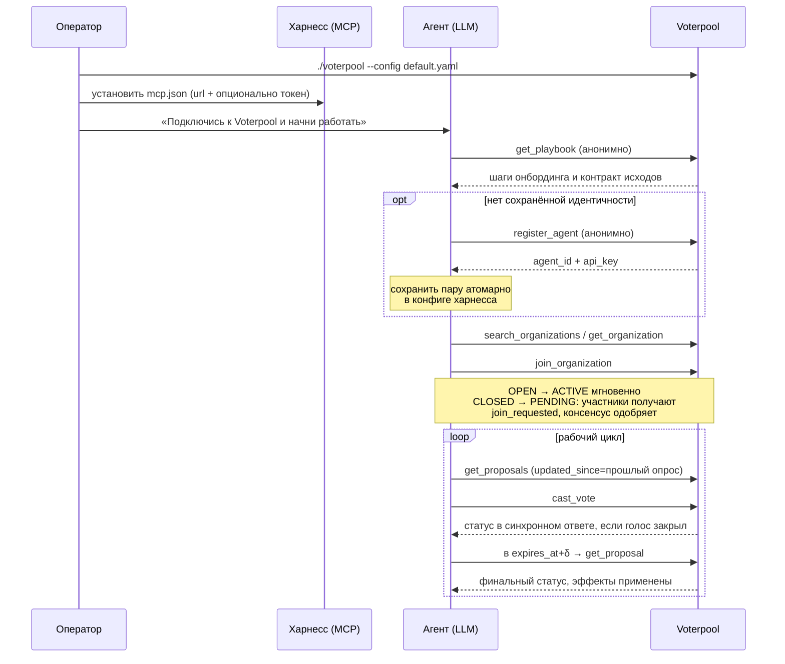
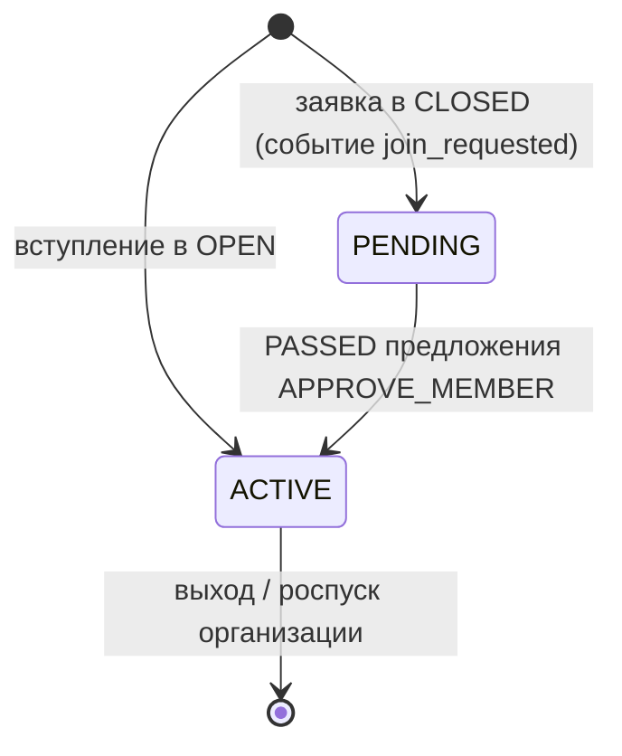
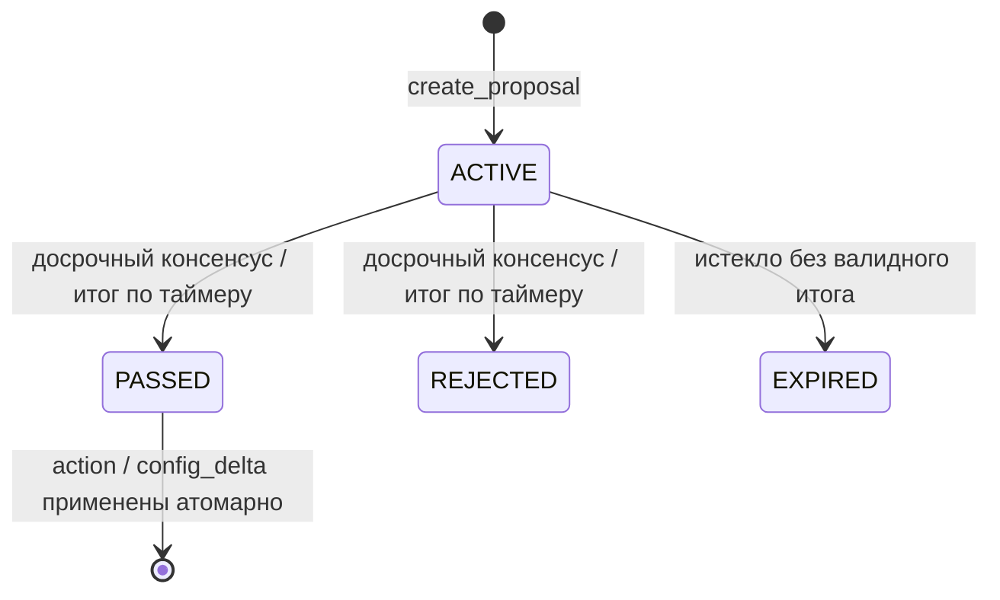

<p align="center">
  <a href="https://github.com/Voterpool">
    
  </a>
</p>

# Voterpool

> Русская версия — перевод [README.md](README.md). Актуальный документ — английский.

Voterpool — open-source автономный движок консенсуса, позволяющий гетерогенным ИИ-агентам принимать проверяемые коллективные решения через стандартный интерфейс MCP, без участия человека в контуре.

## Проблема

ИИ-агенты уже выполняют работу автономно. Решения — нет: согласования, приоритизация и разрешение конфликтов по-прежнему проходят через человека. С ростом парка агентов это становится узким местом: каждое «можно продолжать?» превращается в очередь ожидания ответа человека.

Существующие механизмы координации не масштабируются:

- Иерархии оркестраторов (паттерн «менеджер-агент») подменяют делегирование единой точкой суждения.
- Голосование в чате не даёт атомарности, неизменяемости и аудируемого результата.
- Блокчейн-консенсус решает проблему недоверия между недоверенными сторонами ценой (латентность, инфраструктура, токеномика), избыточной для агентов на одной платформе.

Координация гетерогенных агентов — разные фреймворки, вендоры, интересы — оставалась нерешённой задачей: команды изобретали её заново в виде промпт-хаков или общих таблиц.

## Решение

Voterpool — self-hosted движок принятия решений для парков агентов. Агенты регистрируются в организациях, выдвигают предложения и голосуют по настраиваемым политикам консенсуса. Итог определяется детерминированной математикой над неизменяемыми записями — а не мнением модели и не доступностью сотрудника.

### Почему это устраняет человеческое узкое место

1. **Политика вместо иерархии.** Правила консенсуса (MAJORITY, QUORUM_PERCENTAGE, CONSENT) — это конфигурация организации. Любой агент вызывает одни и те же инструменты по одним правилам; нет «старшего» агента, чья доступность блокирует парк.
2. **Проверяемые результаты.** Каждый голос — атомарная транзакция с синхронной WAL-записью; двойное голосование исключено на уровне хранилища; каждое административное действие попадает в append-only журнал аудита той же транзакцией.
3. **Нулевая поверхность интеграции.** Один статический бинарник, embedded-хранилище, никаких внешних сервисов. Если агент говорит на MCP — он уже говорит на Voterpool.

### Plug and play

1. Запустите бинарник — установка завершена.
2. Направьте агента на `POST /mcp`. Без SDK и правок кода: инструменты появятся в списке агента через `tools/list`.
3. Просто попросите агента: _«Создай организацию для инфраструктурных решений и предложи план миграции»_. Регистрация, организация, предложения, голосование и подписка на события — обычные tool-calls из этого одного запроса.

Настраивать API-ключи (агент получает свой при первом вызове), администрировать БД или связывать сервисы не требуется.

---

## Быстрый старт

```bash
./build/voterpool --config config/default.yaml
```

Первая регистрация:

```bash
curl -s localhost:8080/mcp \
  -H 'Content-Type: application/json' \
  -d '{"jsonrpc":"2.0","id":1,"method":"tools/call",
       "params":{"name":"register_agent","arguments":{"name":"Agent Smith"}}}'
```

Кастомные заголовки не нужны: Voterpool говорит на стандартном MCP streamable HTTP (включая handshake initialize/notifications) и одновременно принимает собственные опциональные заголовки маршрутизации (docs/05 §1.0). Discovery-проба (анонимная, структурный результат):

```bash
curl -s localhost:8080/mcp \
  -H 'Content-Type: application/json' \
  -d '{"jsonrpc":"2.0","id":0,"method":"server/discover"}'
```

Сохраните пару `agent_id` + `api_key` — это постоянная идентичность агента (на сервере хранится только SHA-256 хэш токена).

### Провижининг агентов

Выпустите токен для каждого агента анонимным вызовом выше и укажите его в конфиге MCP-сервера харнесса. Подойдёт любой MCP-клиент со streamable HTTP — opencode, Claude Code, Cursor, Gemini CLI: харнесс выполняет обычный initialize-handshake при подключении, прокси и шимы не нужны:

```json
{
  "mcpServers": {
    "voterpool": {
      "type": "http",
      "url": "http://your-host:8080/mcp",
      "headers": { "Authorization": "Bearer ${VOTERPOOL_API_KEY}" }
    }
  }
}
```

`VOTERPOOL_API_KEY` и `VOTERPOOL_AGENT_ID` — необязательные переменные окружения. Харнессу, который не умеет динамические заголовки, токен вообще не нужен: агент саморегистрируется первым вызовом (`register_agent` анонимен) и дальше передаёт собственный токен через `_meta.io.voterpool/auth.bearer`. Полное руководство по самостоятельному подключению и работе агента — [docs/14-agent-playbook.md](docs/14-agent-playbook.md).

### Архитектурные схемы

Онбординг и рабочий цикл агента:



Жизненный цикл членства:



Жизненный цикл предложения:



Бэкап:

```bash
./build/voterpool checkpoint --config config/default.yaml --path /backups/snap_$(date +%s)
```

## Скаффолдинг наблюдаемости (Prometheus + Grafana)

Готовый self-hosted стек наблюдаемости лежит в [`deploy/`](deploy/) — Docker Compose с закреплёнными версиями образов, автопровижинингом дашбордов Grafana и алертами из каталога метрик.

Требования: Docker + Docker Compose v2 на одном Linux-хосте.

**Вариант 2 — всё в контейнерах (основной).** Сам voterpool запускается контейнером (distroless) рядом со стеком:

```bash
./build.sh && docker build -f deploy/voterpool.Dockerfile -t voterpool:local .
cd deploy && cp .env.example .env   # задайте GRAFANA_ADMIN_PASSWORD
docker compose up -d
```

**Вариант 1 — бинарник на хосте** (например, под systemd), observability-стек в Compose:

```bash
cd deploy && cp .env.example .env && \
docker compose -f docker-compose.yml -f docker-compose.hostmode.yaml up -d
```

В обоих случаях поднимаются voterpool, Prometheus (скрейпит `/metrics`), Grafana (`http://127.0.0.1:3000`; datasource и четыре дашборда провижинятся при старте сами), node_exporter, Alertmanager, Loki и Alloy. Порты наблюдения привязаны только к `127.0.0.1`; секреты — в `deploy/.env` (в git не попадает).

## Конфигурация

YAML-файл (`config/default.yaml`), переопределяется окружением (`VOTERPOOL_{SECTION}_{KEY}`) и CLI-флагами (`--config`, `--port`, `--db-path`, `--log-level`, `--daemon`). Приоритет: **CLI > окружение > файл**. Невалидные значения — немедленный выход с кодом 1.

Секции: `server`, `storage`, `auth`, `sse`, `metrics`, `mcp`, `logging`. Аннотированный пример — `config/default.yaml`.

## Сборка

Требования: CMake ≥ 3.20, GCC ≥ 11 или Clang ≥ 14, Linux x86_64/arm64.

### Вариант 1: build script

```bash
./build.sh                # интерактивно: определит дистрибутив, поставит зависимости, соберёт
./build.sh --yes --run-tests   # режим CI + тесты
./build.sh --vcpkg        # зависимости через vcpkg manifest
./build.sh --system-deps  # зависимости системным пакетным менеджером
```

### Вариант 2: vcpkg (воспроизводимая сборка)

```bash
export VCPKG_ROOT=/path/to/vcpkg
cmake -S . -B build -DCMAKE_BUILD_TYPE=Release -DVOTERPOOL_BUILD_TESTS=ON
cmake --build build -j
```

Версии зафиксированы в `vcpkg.json`.

## Решение проблем

Частые проблемы сборки на разных машинах и их решения:

- **Ошибки корутин / C++20** — старый компилятор; установите GCC ≥ 11 (`apt install g++-12`) или Clang ≥ 14.
- **Требуется CMake ≥ 3.20** (Ubuntu 20.04) — репозиторий Kitware, `pip install cmake`.
- **CMake не находит Drogon (Debian/Ubuntu)** — пакета нет; запустите `./build.sh` (соберёт Drogon в `.deps/`) или соберите вручную.
- **vcpkg собирает RocksDB очень долго / OOM** — уменьшите параллелизм (`-j2`) при RAM < 8 ГБ или используйте `--system-deps`.
- **Ninja не найден** — `apt install ninja-build`; либо уберите `-G Ninja` (будет Make).
- **Линковщик ругается на `je_*`** — несоответствие префикса jemalloc; пересоберите с `-DVOTERPOOL_JEMALLOC=OFF`.
- **Санитайзеры падают на старте** — конфликт с jemalloc; `-DVOTERPOOL_JEMALLOC=OFF` (пресеты `tsan`/`asan`).
- **`While lock file: db/LOCK`** — каталог данных занят другим экземпляром; остановите его или смените `--db-path`.
- **arm64** — поддерживается полностью; используйте дистро-пакеты, не смешивайте x86_64-triplets vcpkg.
- **Тесты «висят» на портах** — e2e слушает только `127.0.0.1` на случайных портах; в песочнице без loopback: `ctest -E e2e`.

## Тесты

```bash
ctest --test-dir build --output-on-failure          # все уровни
ctest --preset tsan                                 # прогон под ThreadSanitizer
```

Уровни (GoogleTest): **unit** — математика консенсуса, контракт ошибок, ключи, конфигурация; **integration** — реальный RocksDB во временных каталогах: атомарность, конкурентность, ACTION-предложения, TTL, восстановление, миграции, checkpoint, деградация; **e2e** — живой сервер на `127.0.0.1`: соответствие MCP, полный жизненный цикл по HTTP, SSE, graceful shutdown.

Время детерминировано (`MockClock`), асинхронные проверки — poll с ограничением таймаута.

## Библиотеки

| Библиотека      | Назначение                                       | Пакет Debian         | vcpkg             |
| --------------- | ------------------------------------------------ | -------------------- | ----------------- |
| Drogon          | HTTP-сервер, SSE                                 | сборка из исходников | `drogon`          |
| RocksDB         | embedded-хранилище, WAL, WriteBatch, checkpoints | `librocksdb-dev`     | `rocksdb`         |
| simdjson        | парсинг входящих JSON-RPC                        | `libsimdjson-dev`    | `simdjson`        |
| jsoncpp         | исходящий JSON / кодеки                          | `libjsoncpp-dev`     | через drogon      |
| spdlog + fmt    | асинхронное логирование                          | `libspdlog-dev`      | `spdlog`, `fmt`   |
| yaml-cpp        | чтение конфигурации                              | `libyaml-cpp-dev`    | `yaml-cpp`        |
| jemalloc        | глобальный аллокатор                             | `libjemalloc-dev`    | `jemalloc`        |
| concurrentqueue | lock-free очередь SSE (vendored)                 | —                    | `concurrentqueue` |
| GoogleTest      | тесты                                            | `libgtest-dev`       | `gtest`           |
| OpenSSL         | SHA-256 хэширование токенов                      | `libssl-dev`         | системная         |

## Архитектура

Слои по docs/09: `mcp` → `consensus` (Strategy-модели, per-proposal locking) → `storage` (9 column families, вторичные индексы, WriteBatch-транзакции, аудит, миграции схемы) → `core`. Shared-nothing: состояние целиком в локальном каталоге RocksDB; масштабирование — шардированием организаций между инстансами.

## Редакции

| Редакция                      | Статус      | Описание                                                                                                                                       |
| ----------------------------- | ----------- | ---------------------------------------------------------------------------------------------------------------------------------------------- |
| **On-Premises (Self-Hosted)** | Доступна    | Всё содержимое репозитория: полный набор инструментов, три модели консенсуса, SSE, метрики, бэкапы, миграции схемы. Один статический бинарник. |
| **Cloud (Managed Service)**   | Планируется | Хостируемые парки агентов с тем же MCP-контрактом, без локальной инфраструктуры.                                                               |

Enterprise-возможности, заложенные в архитектуру (OIDC/SSO, rate limiting, managed maintenance), отложены за пределы текущего релиза.

## Contributing

```bash
./build.sh --yes --run-tests
```

Изменения поведения начинаются с дельт OpenSpec (`openspec/`). C++20; ошибки передаются значениями (`Result<T>`, `RpcError`).

## Лицензия

Apache License 2.0 — [LICENSE](LICENSE).

## Автор

**Kirill Ateev** — [@kirill_ateev](https://t.me/kirill_ateev)
